# Utilizando los comandos GRANT y REVOKE en PostgreSQL
		

Cuando se trata de la seguridad de los datos almacenados es muy importante tener en cuenta las siguientes consideraciones sobretodo en ambientes productivos:
		

		<ul>
		<li>Los datos de cualquier tabla deben ser accesibles únicamente a los usuarios del DBMS que realmente necesiten esa información, el resto no debe tener acceso.</li>
		<li>A cada uno de los usuarios del DBMS que tienen acceso a una determinada tabla, se les debe de asignar una cierta acción según sus necesidades, por ejemplo a ciertos usuarios se les permitirá ejecutar un <tt>UPDATE</tt>, mientras que al resto (o a todos) se les permitirá únicamente ejecutar un <tt>SELECT</tt>.</li>
		<li>En ciertos casos incluso para la ejecución de un <tt>SELECT</tt> solo se permitirá que un usuario del DBMS pueda consultar una tabla a nivel de ciertas columnas.</li>
		</ul>
		

		Cabe recordar que en producción los usuarios del DBMS son asociados más con aplicaciones o grupos de programas que con usuarios operativos.
		Existen tres conceptos en el esquema de seguridad SQL: Usuarios, Objetos y privilegios. 
		

		<h2>Privilegios</h2>
		
Los privilegios suelen clasificarse en privilegios del sistema y de objetos.

		
Los privilegios del sistema permiten al usuario realizar algún tipo de operación que afecta a todo el sistema. 

		
Los privilegios de objetos se definen como las acciones que le son permitidas a un usuario ejecutar en un determinado objeto de la base de datos (tabla,vista,secuencia,función), esto una vez que el usuario haya sido autentificado dentro del DBMS.

		
Los privilegios de objetos dependen del tipo de objeto, por ejemplo el estándar SQL1 especifica 4 privilegios para tablas y vistas:

		<ul>
		<li><b>SELECT</b> - Permite consultar todas las filas.</li>
		<li><b>INSERT</b> - Permite la creación de nuevos registros.</li>
		<li><b>DELETE</b> - Permite la eliminación de filas.</li>
		<li><b>UPDATE</b> - Permite la modificación de filas ya creadas.</li>
		</ul>
		
Para el resto de los objetos en <b>PostgreSQL</b> pueden o no aplicar los siguientes privilegios:

		<ul>
		<li><b>RULE</b> - Permite la creación de reglas para una tabla o una vista.</li>
		<li><b>REFERENCES</b> - Permite la creación de llaves foráneas (foreign key) al crear relaciones.</li>
		<li><b>TRIGGER</b> - Permite la creación de triggers.</li>
		<li><b>EXECUTE</b> - Permite la ejecución de funciones o store procedures.</li>
		<li><b>ALL</b> - Permite todos los privilegios.</li>
		</ul>
		
De manera predeterminada en <b>PostgreSQL</b> cuando se crea un objeto el creador del objeto es el propietario y se le asignan todos los privilegios sobre ese objeto, el resto de los usuarios no tiene ningún privilegio sobre ese objeto.

		
El <b>DDL (Data Definition Language)</b> incluye dos comandos para conceder y retirar privilegios: <b>GRANT</b> y <b>REVOKE</b>

		
Como ejemplo voy a crear la siguiente tabla en una base de datos llamada <i>bibl</i>, cuyo dueño de la base de datos es el usuario <b>postgres</b>.

		<pre>
		CREATE TABLE Authors(
	   author_id        serial primary key,
	   author_name     varchar(256),
	   author_lastname     varchar(256),
	   author_birthdate     date
	   );
		</pre>
		

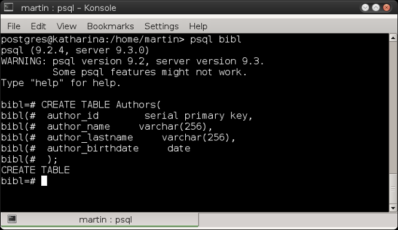

 
		
Paso siguiente voy a insertar unos registros:

		<pre>
	  insert into authors(author_name,author_lastname,author_birthdate)
	  values('Elizabeth','Bishop','02/08/1911');
	  
	  insert into authors(author_name,author_lastname,author_birthdate)
	  values('Charles','Dickens','07/02/1812');
	  
	  insert into authors(author_name,author_lastname,author_birthdate)
	  values('Jack','London','12/01/1876');
	  
	  insert into authors(author_name,author_lastname,author_birthdate)
	  values('Joseph','Conrad','03/12/1857');
		</pre>
	  
Hago un <tt>SELECT</tt> y muestro los registros de la tabla.

	  

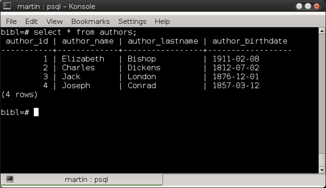

 
	  
Como se ve con el usuario <b>postgres</b> pude ejecutar sin ningún tipo de restricción las siguientes acciones: <tt>CREATE, INSERT y SELECT</tt>

	  
Ahora ingresaré con un usuario distinto al usuario <b>postgres</b>, ingresaré en la base de datos con el usuario <b>martin</b> y ejecutaré un <tt>SELECT</tt> sobre la tabla <i>authors</i>.

	  
Al ejecutar el <tt>SELECT</tt> <b>PostgreSQL</b> nos muestra los siguientes mensajes:

	  <pre>
	  ERROR:  permission denied for relation authors
	  STATEMENT:  SELECT * FROM authors;
	  ERROR:  permission denied for relation authors
	  </pre>
	  

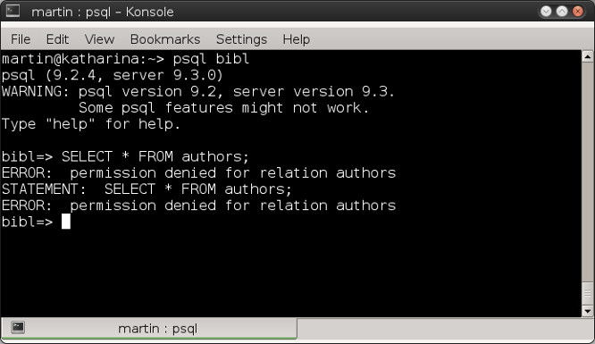

 
	  <h2>GRANT</h2>
	  
Estos mensajes me indican que el usuario <b>martin</b> no tiene los privilegios necesarios para ejecutar el <tt>SELECT</tt> en esa tabla y que por lo tanto no podrá leer los registros a menos que el usuario propietario <b>postgres</b> conceda el privilegio de hacerlo ejecutando el comando <tt>GRANT</tt>.
	  La sintaxis básica del comando es:

	  <pre>
	  GRANT [privilegios] ON [objeto] TO {public | group | username}
	  </pre>
	  
Así que con la sesión de <b>postgres</b> ejecuto el siguiente comando:

	  <pre>
		GRANT SELECT ON authors TO martin;
	  </pre>
	  

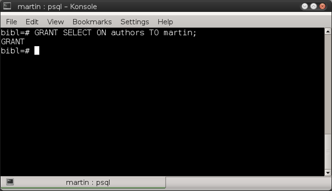

 
	  
Regresando a la sesión del usuario martin, vuelvo a ejecutar el comando <tt>SELECT</tt>.

	  <pre>
		SELECT * FROM authors;
	  </pre>
	  
Ya es posible que el usuario <b>martin</b> pueda ejecutar la consulta.

	  

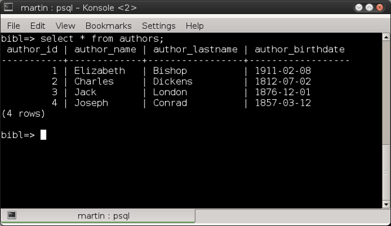

 
	  
Ahora intentaré crear un nuevo registro

	  <pre>
	  insert into authors(author_name,author_lastname,author_birthdate)
	  values('Gustave','Flaubert','12/12/1821');
	  </pre>
	  
<b>PostgreSQL</b> me envía el siguiente mensaje debido a que este usuario no tiene el privilegio de <tt>INSERT</tt>:

		<pre>
		ERROR:  permission denied for relation authors
		</pre>
	  

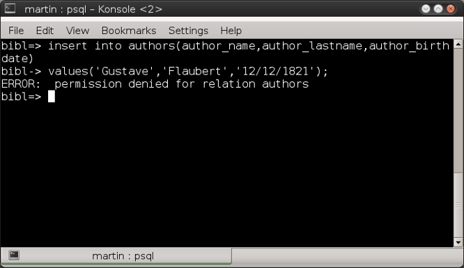

 
	  
Concedo al usuario <b>martin</b> el privilegio de <tt>INSERT</tt>, con el siguiente comando ejecutado por el usuario <b>postgres</b>

	  <pre>
	  GRANT INSERT ON authors TO martin;
	  </pre>
	  

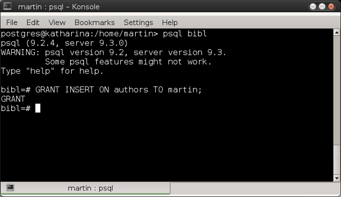

 
	  
Ejecuto nuevamente el <tt>INSERT</tt> y <b>PostgreSQL</b> me envía ahora el siguiente mensaje:

	  <pre>
	  ERROR: permission denied for sequence authors_author_id_seq
	  </pre>
	  

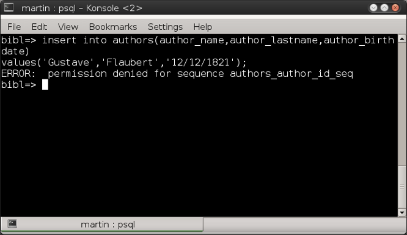

 
	  
Concedo entonces al usuario <b>martin</b> el privilegio de poder actualizar la secuencia con el siguiente comando (debe ser ejecutado por <b>postgres</b>):

	  <pre>
	  GRANT UPDATE ON authors_author_id_seq TO martin;
	  </pre>
	  

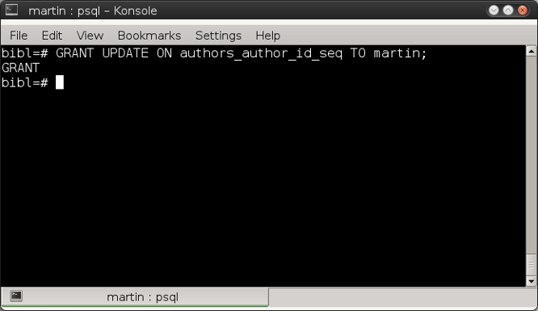

 
	  
Con los privilegios otorgados a la tabla y a la secuencia ahora ya es posible crear el registro.

	  

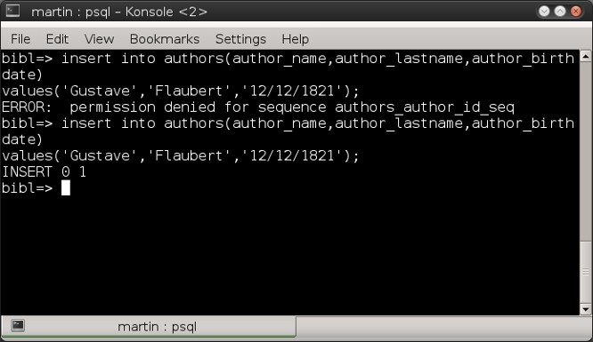

 
	  
Para mostrar los privilegios que se tienen sobre un determinado objeto, utilizamos el comando <tt>\z</tt>.
	  La sintaxis es:

	  <pre>
	  \z [nombre del objeto]
	  </pre>
	  
Para este ejemplo ejecutamos:

	  <pre>
	  \z authors;
	  </pre>
	  

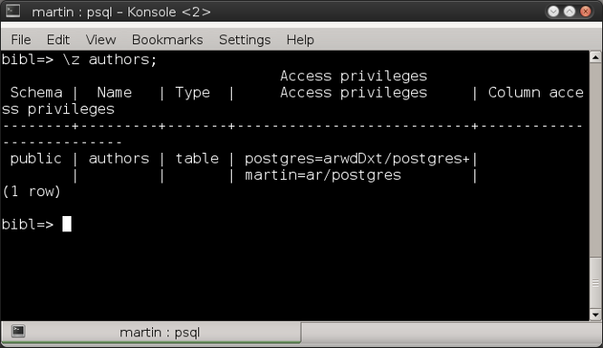

 
	  <h2>REVOKE</h2>
	  
De la misma manera que se otorgaron los privilegios al usuario <b>martin</b> se le pueden retirar con el comando <b>REVOKE</b> la sintaxis básica del comando es:

	  <pre>
	  REVOKE [privilegios] ON [objecto] FROM {public | group | username }
	  </pre>
	  
Así que con el usuario <b>postgres</b> ejecuto los siguientes comandos para retirarle los privilegios otorgados a <b>martin</b> en la tabla y en la secuencia:

	  <pre>
	  REVOKE INSERT,SELECT ON authors FROM martin;
	  REVOKE UPDATE on authors_author_id_seq FROM martin;
	  </pre>
	  

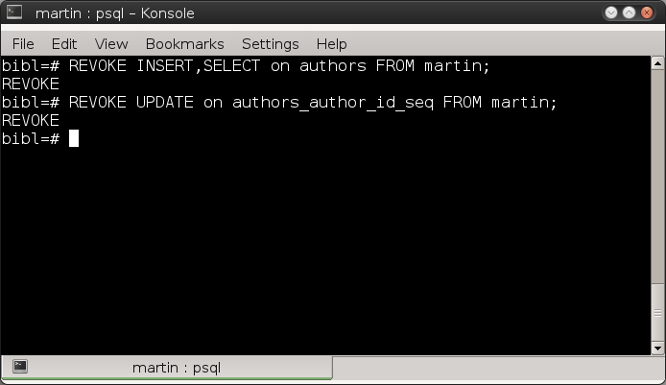

 
	  
Si mostramos los privilegios de la tabla y de la secuencia, observamos que ya no se muestran los privilegios para el usuario <b>martin</b> , esto por que los quito el usuario <b>postgres</b>, quien es el propietario de los objetos. Para mostrar los privilegios de ambos objetos (secuencia y tabla) únicamente ejecuto el comando <tt>\z</tt> sin argumentos.

	  

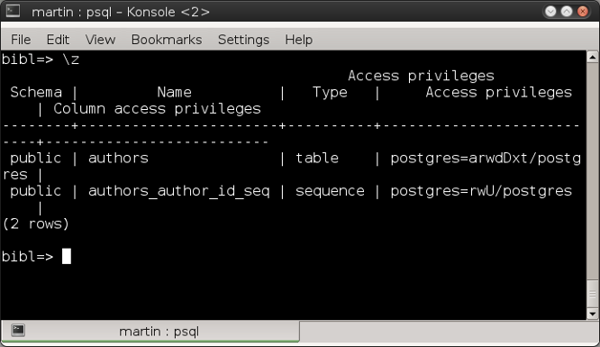

